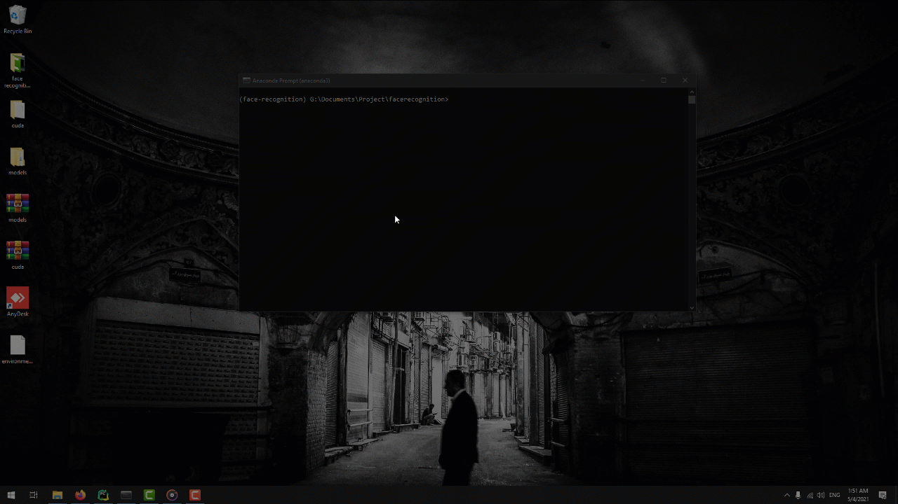
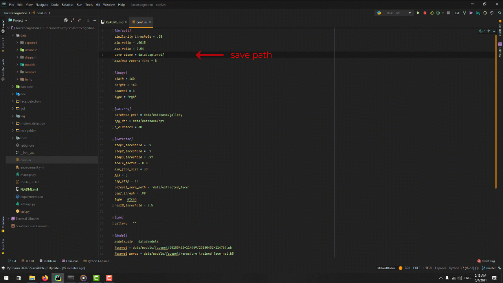
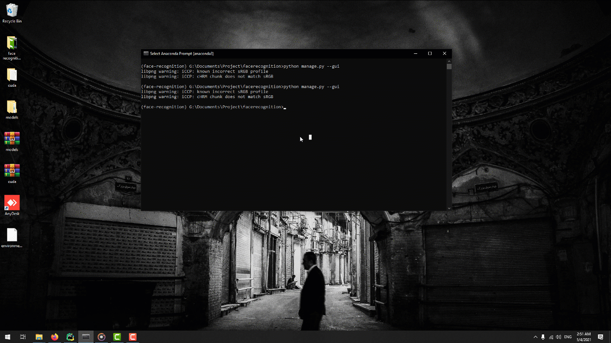
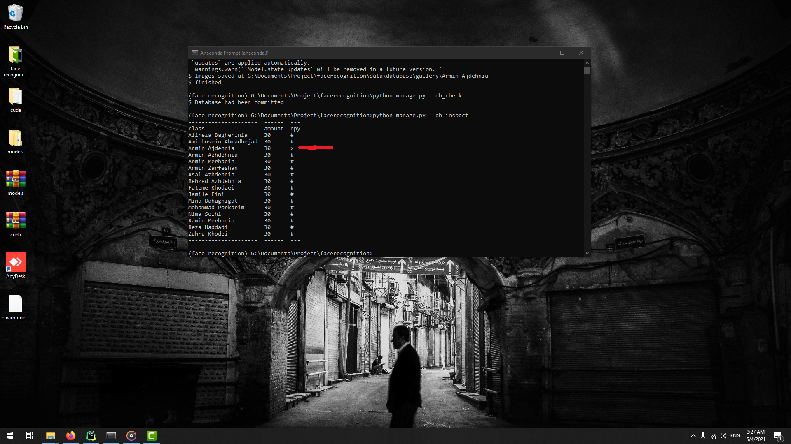
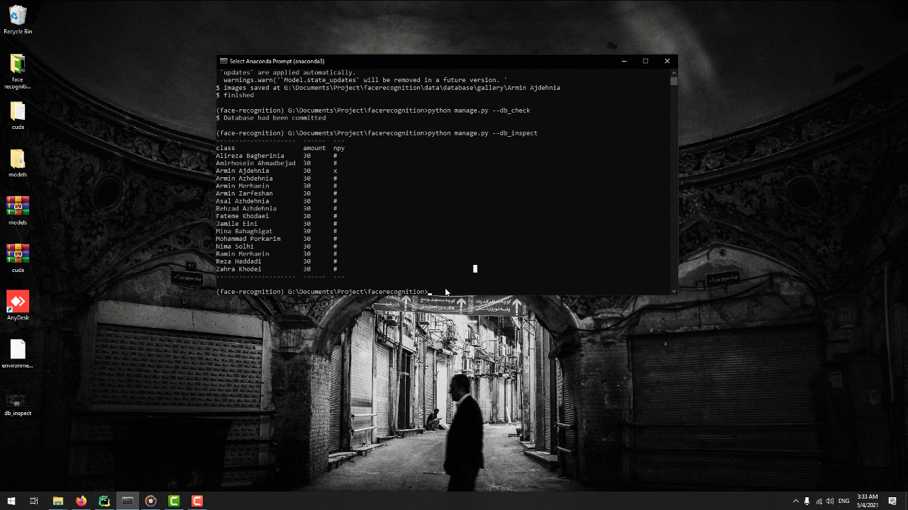

# Face Recognition Demo
In these document we are going to have brief introduction of registering identities on face recognition system 

## Prepare environment
 After install and set up the environment, now it is the time to use the system to register identities to database 
 and then run the system
### Activating conda environment variable

Open **anaconda base** CMD and then type  

    conda activate face-recognition

> Note: After activating the environment variable, we change our directory to project root

## Register Identity Faces
For registering faces we have two ways to cluster faces for gallery set, one way is like this.
### Open Demo GUI
For running a demo gui for record identity faces, we do just like this
in prepare environment variable in shell or cmd, type the instruction bellow.

    python manage.py --gui

### Record Identity Faces
> Note: before run the gui we should connect a camera to the pc, and it is better use and set **640x480** resolution
> on camera setting

A recorded face should change his frontal face on various directions.

#### Record Option

> Note: you do this job for other identities

### Cluster Recorded faces
After that, we should cluster faces to take centroids of similar frames on each video. 
Let`s do this. we should close the gui because we do not need it anymore, and in cmd or shell we type the command bellow

    python manage.py --cluster --cluster_bulk

### Check Database Status
After every clustering process, we should stable it. 
First thing first, we type command bellow

    python manage.py --db_check

after

    python manage.py --db_inspect

as we can see the new identity had has been added to the database, but has no npy file. 
with command bellow we can create npy file for registered identities and stable the database

    python manage.py --db_build_npy

## Realtime
Now it is time to run the system in realtime mode to recognize person

    python manage.py --realtime

## Configuration Settings
in **conf.ini** file, we have option to configure them.
### Default

**similarity_threshold** is a numeric value in range [0,1], lower value make the system more **accurate**. 
**min_ratio** is numeric value that we can set for detect further faces. 
**max_ratio** is numeric value that we can set for detect closer faces. 